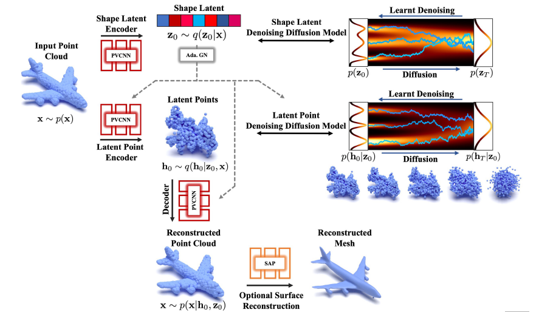

## Paper Review

By Zitao Shuai (ztshuai@umich.edu) 

### Basic Information

Title: LION: Latent Point Diffusion Models for 3D Shape Generation

Source: NIPS2022

Institute: UofToronto

### Overview

Generating 3-D objects is a long-standing problem. So far we have seen the great performance of the diffusion model in generating images, videos, as well as 3-D molecules. Similar to the Geo-diffusion paper which focuses on generating 3-D molecules in a controlled way, this paper targets generating 3-D objects with flexibility in adjusting their shape. The idea of this paper satisfies the intuition of point-cloud modeling.

Note:

The method of this paper is cleaner and it utilizes the shape information and the point-cloud information by explicitly encoding them to a latent space. Even though their method looks simple, they have strong motivations and have done comprehensive experiments to support their points. The paper has shown the great ability of this proposed 3-D diffusion model in many tasks. 

### Motivation

#### General de-noising 

That might be the first difference with the 3-D molecule diffusion paper, one of the motivations of this paper is that only using VAE might lead to mismatching. Hence they introduce the latent diffusion model and utilize the high expression ability of the model.

And the mismatch can be viewed as another type of noise. In the 3-D shape generation domain, they claim the mismatch is the prior hole problem.

#### Controlling the generation

Using the diffusion model to control the generation to flexibly get the samples we want is often a main motivation of diffusion-related papers. 

This point is the core of the paper. The authors first propose three wanted properties of the DDMs, and the last two are related to this. (I have noticed an interesting phenomenon, there are few papers that only focus on the high-resolution or high-generation quality of the DDM model.)

### Insight: Global-local disentanglement

Even though the pipeline of the method is quite clear and easy to understand, their simple but efficient approach to utilizing the shape information and the point cloud information is very insightful.

This paper considers the disentanglement explicitly, which satisfies our intuition. In this task, we naturally have two types/modalities of information: shape information and point-cloud information.

I'd like to view the shape latent as global information, and the point-cloud information as local information.

That's because:

Assumption: the shape of a model satisfies the spatial consistency property, which means the characteristics of a given point are similar to those of its neighbors.

Thoughts: we don't need to learn the detailed structure of the shape of the object, and the shape features might not be point-specific. 

A feasible solution: we don't need to fuse the information of the shape feature with the information of the point cloud.

Benefit: we can flexibly adjust the integral style of the shape while learning diverse semantics of the point cloud combinations. 

### Insight: Diffusion as a unit

Without the diffusion model, traditional frameworks like the VAE shown in the paper might have the ability to handle the 3-D generation problem. While the backbones remain unchanged, we introduce the additional diffusion unit to enhance the latent space.

Based on recent papers we have read, we might like to summarize the paradigm of adapting diffusion model to enhance down-stream tasks:

1. first, we might have a point that is related to de-noising/controlling/fusing that needs to be improved.
2. the original network structure has a latent space where we fuse/disentangle/regularize/etc. the representations.
3. we apply the diffusion model in the original latent space.
4. often, we need a two-stage training pipeline, where we train the original network firstly to get a coarse representation space; then we train the diffusion model to get the desired properties.

We can take this paper as an example:

Without the diffusion model, the SAP and PVCNN can handle the 3D generation problem with some flaws. From the picture, we can see that the latent points look good but lack the desired properties for generating diverse samples, controlled generation, etc.

Hence the authors train the VAE backbone first to get a coarse latent space, then they train the diffusion model to get fine-grained representation, and tune the SAP finally.
