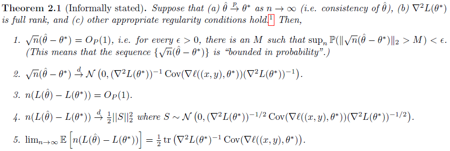

## Chapter 2: Asymptotic Analysis

### Motivation

We focus on how large the bound of the error on our fitted model using the ERM (Empirical Risk Minimization) strategy is with $n$ training sample.

### How: to describe the error?

Firstly, we should know about the **ideal model** and give a suitable definition for it.

**Based on the lowest error**: $inf_{\theta\in \Theta}L(\theta) $

Then consider our fitted model: $L(\hat{\theta})$, we expect the gap between the two one is lower.

$L(\hat{\theta})-inf_{\theta\in \Theta}L(\theta) \le f(n)$

We expect $f(n)$ to decrease faster like $e^{-x}$ when we consider this error bound.

### Easy case from Taylor expansion

#### Spotlights:

We might consider the difference value of the two Ls as a differential term. Hence we might think of **curving this term using differential-based methods and central limit theory**.

Then we might consider $n,\sqrt{n}$  or $\frac{1}{n},\frac{1}{\sqrt{n}}$ as the function $f(n)$.

#### Summary for proofs of these theorems:

1. notice that the $L(\theta^{*})$ has good properties: minimal so that the gradient is equal to 0.
2. we focus on the speed of converge or the speed of degrading of the $f(n)$, hence we will consider $\hat{X}-E(X)$, and it is interesting to bridge the $L$ to $X$.
3. Since $L$ is a function, we first consider the $\theta-\theta^*$ using central limit theory, then we consider the function of $L$ with Taylor expansion. In this way, it's easy to think of $\frac{1}{n}$ and $\frac{1}{\sqrt{n}}$.