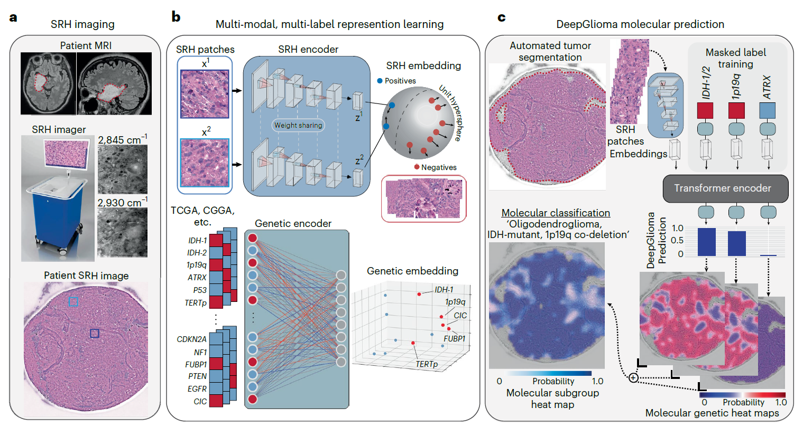

## Paper Review

By Zitao Shuai (ztshuai@umich.edu) 

### Basic Information

Title: Artificial-intelligence-based molecular classification of diffuse gliomas using rapid, label-free optical imaging

Source: Nature Medicine 2023

Institute: UMich

### Overview

This paper presents an artificial intelligence-based diagnostic system for the rapid molecular diagnosis of diffuse gliomas. This paper utilizes a multimodal dataset, including stimulated Raman histology (SRH) and public genomic data. The study was conducted across multiple international centers on a cohort of 153 patients, which verifies the capability to predict molecular alterations. With high classification accuracy, the research highlights the potential of combining artificial intelligence and optical histology as a rapid and scalable adjunct to traditional wet lab methods for screening patients with diffuse glioma.

### Understanding technical contribution

The analysis experiments do not focus on the ablation results of the model or some robustness check on the hyper-parameters, and the method section is simple. So we just consider the main graph to try to understand their method.

This main graph still has three parts like another paper we have read this week. The first one demonstrates the input data: SRH images. The second graph shows the training process and high-levelly introduces their model structures: they might aim to train two encoders for the two modalities separately and utilize them for the prediction process. The third subgraph shows the inference process of their model.

I think it's not clear to me to understand the model structure and the type of data flow. But it has shown the workflow of their method, which is high-level and focuses on their problem and the data they have used. Maybe this is the writing style of the sub-journal of the CNS.

### Something about the experiment and dataset

Through the two papers we have read, I think the papers accepted by top journals more focus on specific problems and adapt some mature methods to the corresponding datasets to tackle these problems. So the dataset they use is important, and the findings, in which degree they have addressed the problems are also important.

So we might see some common points:

1.  the introduction of the dataset and workflow is essential. Because the first one shows the problem we want to solve, and the workflow demonstrates what we have done. 
2. the experiments should be comprehensive and have direct and practical meaning. The comprehensive should be: consider multiple metrics; divide the dataset into multiple meaningful subgroups, and conduct experiments on them.
3. The visualization should be really important, and we also want to investigate the contributions of some features to the prediction result to make the paper more trustworthy.

The design of the graphs here is really complex, which can be utilized for our further study:

1. we can use two dimensions to show one metric across different subgroups, instead of using a long row to describe them.

 

2. error bars, scatter points, clusters, and distributions of the dataset are stronger than just using words to describe the corresponding information.
