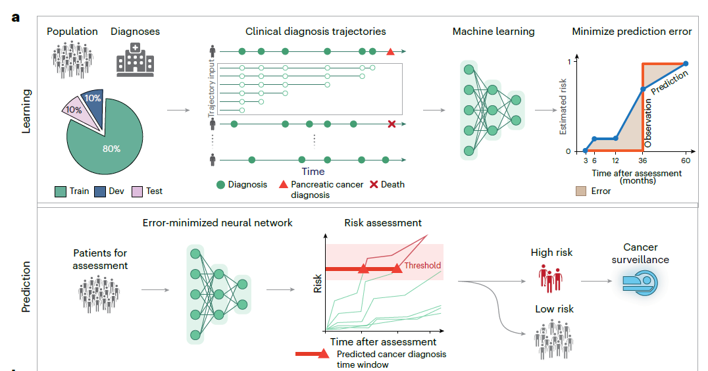

## Paper Review

By Zitao Shuai (ztshuai@umich.edu) 

### Basic Information

Title: A deep learning algorithm to predict risk of pancreatic cancer from disease trajectories

Source: Nature Medicine

Institute: so many

### Overview

#### Why is it worth a sub-journal of nature

I think this is an excellent empirical study paper, and I'd like to rate it in the following dimensions:

| feature    | rate                                                         |
| ---------- | ------------------------------------------------------------ |
| problem    | strong but not novel                                         |
| dataset    | really large and comprehensive, the result of this work is valuable |
| experiment | the analysis experiments are well-designed                   |
| result     | the results are amazingly match their claims and show interesting findings |
| method     | the method is not important in CNS in the data science track I think |

Since the dataset and experiment are really valuable for practical application, this paper deserves a high position.

#### A stats-style factor research with EHR

In addition to the interesting problem they focus on, the type of data they have used is fashionable in 2022 as well. The combination of EHR and NLP brings many recent AI+clinic healthcare works. 

And for the style of the paper, I think they try to reveal more scientific findings so they conduct their experiments in a factor research way. And this approach could benefit the trustworthiness of the result of the AI, since we have seen the effect of "importing a factor".

And I think the factors they have tested can be taken into consideration in our further research:

1. time-series prediction
2. study on the effect of age [I think we can also conduct experiments on other sensitive attributes]
3. consider the effect of data period, different periods of data as different factors. [they use "feature contribution" in replace of the coefficients and the p-value in traditional empirical study papers using linear regression]

#### Design of the main graph

Graph A:

We can summarize some points:

1. to highlight their empirical findings, they strengthen the output: risk with groups and the data they focus on: clinical diagnosis trajectories. This makes sure their novelty won't be attacked. 
2. also, they have shown the sensitive features they have discussed and the methods they have conducted, in order to demonstrate that they have conducted comprehensive results on different kinds of machine learning models and have shown results on topics that we are concerned.
3. for method, they only mention a network here, it's less important compared to other parts
4. they also illustrate the details of risk, which ensures the point won't be misunderstood.
